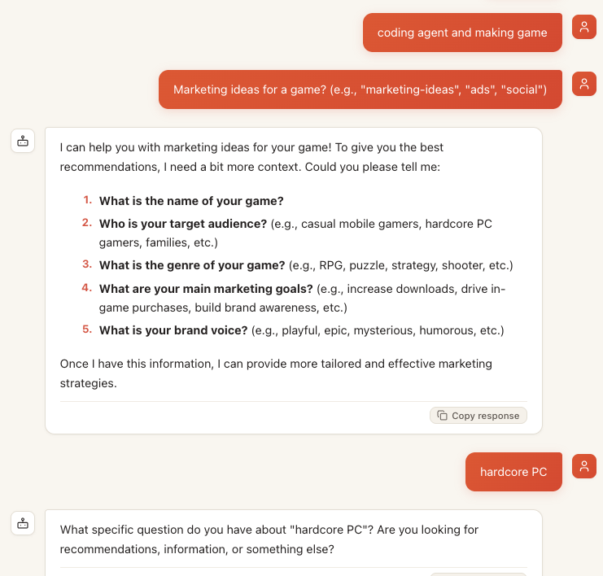

# Marketing Agent

**English** · [简体中文](README.zh-CN.md)

> **One AI that doesn't try to do everything badly — it runs a whole marketing team.**
> And it plugs straight into the 150+ marketing tools you already pay for.

[**→ Try it in 60 seconds**](#quick-start) · [**→ Mastra campaign engine**](#mastra-campaign-orchestrator) · [**→ See real output**](#see-real-output) · [**→ Browse the 150+ integrations**](#plugs-into-your-stack) · [**→ Meet the team**](#meet-the-team)

Most marketing AIs are a single generalist: ask it about SEO and it's okay, ask it
about paid ads and it's okay, ask it to write the launch email and it's… okay. The
result is shallow work across every channel.

This project takes a different bet. Instead of one person faking every job, the
agent is structured as a **real marketing org**: a Growth Lead who directs, and six
specialists — search, social, SEO, B2B, lifecycle, and more — each with their own
voice, instincts, playbook, and toolkit. You talk to the team the way you'd brief an
agency: tell them the goal, and the right specialist picks it up — then hands off to
the platform tools that actually execute.

It's built for founders, marketers, and growth teams who want expert-level thinking
on tap — strategy, copy, campaigns, SEO, lifecycle flows — without paying seven
salaries or copy-pasting out of a chat window.

> **Stop briefing a chatbot. Start commanding a team.** ↓

<table align="center">
  <tr>
    <td align="center"></td>
    <td align="center"></td>
  </tr>
  <tr>
    <td align="center"><sub>Start screen — pick a specialist and brief the team</sub></td>
    <td align="center"><sub>Chat — the Director routes your brief to the right role</sub></td>
  </tr>
</table>

---

## Why this shape

A competitive marketing team doesn't succeed because one person is brilliant at
everything. It succeeds because the work is **divided into domains**, each owned by
someone who lives and breathes it. That division is exactly what's missing from
"one prompt does all" tools.

So this agent makes the division explicit:

- You get a **Director** who thinks about budget, channels, and the whole picture.
- You get **specialists** you can switch into when a job needs depth — the SEO person
  thinks about crawl budgets and search intent; the paid-search person thinks about
  ROAS and negative keywords; the lifecycle person thinks about churn curves and LTV.
- The output reads like it came from someone who actually does the job, not a
  word-salad summary.

The payoff: answers that are specific, opinionated, and end on a concrete next step
instead of "it depends."

---

## Feature matrix

| | Capability | What it means in practice |
|---|---|---|
| 🎯 | **9 roles** | Director, Growth Lead, Paid Search, Social Ads, SEO, B2B/LinkedIn, Lifecycle & Retention, Virtual Seth (intern mentor), Solo Founder (SMTM orchestrator). Each has its own persona, focus, and instincts. |
| 📚 | **48 native + 25 external skills** | Deep playbooks — copywriting, ads, SEO audits, ABM, churn prevention — plus the 25-skill money-hxn "Show Me The Money" business suite, auto-discovered from an external path. |
| 🧰 | **100+ platform integrations** | Reference guides for the tools real marketers use (Google Ads, GA4, Klaviyo, HubSpot, Apollo, Ahrefs, …), loaded on demand. |
| 🧠 | **Layered prompting** | Director base → active role → active skill. Compose a specialist *with* a playbook for deep, focused execution. |
| 💾 | **Deliverables on disk** | Final copy, strategies, keyword lists saved to `output/` as files — not lost in a chat scroll. |
| 🗂️ | **Session + memory persistence** | `.sessions/` stores conversation history (SQLite checkpointer, survives restarts) + project memory (product, ICP, goals, decisions). Auto-resumes your last session; `/remember` + `/recall` tools let the agent save facts across sessions. |
| 🔍 | **Grounded, not guessed** | Real-time facts (prices, competitor moves, keyword popularity) are searched before they're stated. The Virtual Seth role cites real blog posts via `lookup_seth_post`. |
| 🌐 | **Bilingual (EN default)** | English by default; `/lang zh` (or `--language zh`) switches to Chinese. Every role ships as an `.en.yaml` + `.zh.yaml` pair. |
| 🎬 | **CLI animations** | ASCII spinner, progress bars, streamed thinking blocks (💭) and tool-call progress (🔧) — terminal polish that makes the agent feel alive. |
| 🔌 | **Bring-your-own model** | OpenRouter (default, free tier) or Vertex AI via service account (burns GCP trial credits). GLM via the Zhipu coding plan. |
| ⚙️ | **Two runtimes, one brain** | [Python CLI](#quick-start) for terminal-first users + [Mastra engine](#mastra-campaign-orchestrator) for campaign workflow orchestration. Share the same roles, skills, and tool integrations. |
| 🧩 | **Multi-turn conversations** | Both runtimes now support persistent chat sessions with memory of past turns. |
| 🏗️ | **Campaign workflows** | Mastra engine runs structured 3-step plans: strategy → execution → review. |
| 👔 | **Supervisor delegation** | Mastra engine's Director agent routes work to specialists automatically. |
| 🧠 | **Cross-session memory** | Both runtimes remember your product, ICP, brand voice, and past campaigns across sessions. |
| 🎨 | **Mastra Studio Web UI** | Full chat UI with model dropdown, role sidebar, campaign dashboard, thinking blocks, tool call visualization — shipped and customized. |

---

## Plugs into your stack

This is where most "marketing AI" stops at copy. **This one ships a real toolkit:**
**64 ready-to-run CLIs** + **90+ integration guides**, covering 150+ of the platforms
real marketers live in — Google Ads, Klaviyo, GA4, Ahrefs, HubSpot, Apollo, and the
rest. The agent reads the how-to on demand and, where you've added a key, can drive
the tool itself. No vendor lock-in, no walled garden.

> 💡 **Everything below is in the repo today** — `tools/clis/` for zero-dependency
> scripts you can run right now, `tools/integrations/` for the full reference library.

Every CLI follows the same shape — `{tool} <resource> <action> [options]`, JSON to
stdout, keys read from env vars. So once you've seen one, you've seen them all.
Full source of truth: [`tools/clis/README.md`](./tools/clis/README.md). The complete
inventory, organized by category:

### 💰 Ads

| Category | Tool |
|---|---|
| Ads | [Google Ads](https://ads.google.com) |
| Ads | [LinkedIn Ads](https://business.linkedin.com/marketing-solutions/ads) |
| Ads | [Meta Ads](https://www.facebook.com/business/ads) |
| Ads | [TikTok Ads](https://ads.tiktok.com) |

### 🔍 SEO

| Category | Tool |
|---|---|
| SEO | [Ahrefs](https://ahrefs.com) |
| SEO | [DataForSEO](https://dataforseo.com) |
| SEO | [Google Search Console](https://search.google.com/search-console) |
| SEO | [Keywords Everywhere](https://keywordseverywhere.com) |
| SEO | [SEMrush](https://semrush.com) |
| SEO | [RankParse](https://rankparse.com) |

### ✉️ Email & SMS

| Category | Tool |
|---|---|
| Email/CRM | [ActiveCampaign](https://activecampaign.com) |
| Email/SMS | [Brevo](https://brevo.com) |
| Email | [Customer.io](https://customer.io) |
| Email | [Kit](https://kit.com) |
| Email/SMS | [Klaviyo](https://klaviyo.com) |
| Email | [Mailchimp](https://mailchimp.com) |
| Email | [Postmark](https://postmarkapp.com) |
| Email | [Resend](https://resend.com) |
| Email | [SendGrid](https://sendgrid.com) |
| Newsletter | [Beehiiv](https://beehiiv.com) |
| Push | [OneSignal](https://onesignal.com) |

### 📊 Analytics

| Category | Tool |
|---|---|
| Analytics | [Adobe Analytics](https://business.adobe.com/products/analytics) |
| Analytics | [Amplitude](https://amplitude.com) |
| Analytics | [Google Analytics 4](https://analytics.google.com) |
| Analytics | [Mixpanel](https://mixpanel.com) |
| Analytics | [Plausible](https://plausible.io) |
| Analytics | [Segment](https://segment.com) |
| Product Analytics | [Pendo](https://pendo.io) |
| Competitive Intelligence | [SimilarWeb](https://similarweb.com) |
| CRO | [Hotjar](https://hotjar.com) |
| A/B Testing | [Optimizely](https://optimizely.com) |

### 🤝 CRM, Messaging & Lifecycle

| Category | Tool |
|---|---|
| Messaging | [Intercom](https://intercom.com) |
| CRM | [Close](https://close.com) |
| Sales Engagement | [Outreach](https://outreach.io) |

### 🎯 Outbound & Enrichment

| Category | Tool |
|---|---|
| Data Enrichment | [Apollo.io](https://apollo.io) |
| Data Enrichment | [Clearbit](https://clearbit.com) |
| Data Enrichment | [Clay](https://clay.com) |
| Data Enrichment | [ZoomInfo](https://zoominfo.com) |
| Email Outreach | [Hunter.io](https://hunter.io) |
| Email Outreach | [Instantly.ai](https://instantly.ai) |
| Email Outreach | [Lemlist](https://lemlist.com) |
| Email Outreach | [Snov.io](https://snov.io) |
| Partnerships | [Crossbeam](https://crossbeam.com) |
| Developer Prospecting | [GitHub Prospects](https://github.com) |

### ⭐ Reviews & Social

| Category | Tool |
|---|---|
| Social | [Buffer](https://buffer.com) |
| Reviews | [G2](https://g2.com) |
| Reviews | [Trustpilot](https://trustpilot.com) |

### 🎥 Webinar, Video & Forms

| Category | Tool |
|---|---|
| Webinar | [Demio](https://demio.com) |
| Webinar | [Livestorm](https://livestorm.co) |
| Video | [Wistia](https://wistia.com) |
| Forms | [Typeform](https://typeform.com) |
| Scheduling | [Calendly](https://calendly.com) |
| Scheduling | [SavvyCal](https://savvycal.com) |

### 💳 Payments, Referral & Affiliate

| Category | Tool |
|---|---|
| Payments | [Paddle](https://paddle.com) |
| Affiliate | [PartnerStack](https://partnerstack.com) |
| Referral | [Mention Me](https://www.mention-me.com) |
| Referral | [Rewardful](https://www.getrewardful.com) |
| Referral | [Tolt](https://tolt.io) |

### 🔗 Links, Search & Automation

| Category | Tool |
|---|---|
| Links | [Dub.co](https://dub.co) |
| AI Search | [Exa](https://exa.ai) |
| Automation | [Zapier](https://zapier.com) |
| Data Integration | [Coupler](https://coupler.io) |
| Reporting | [Supermetrics](https://supermetrics.com) |

### 🤖 AI & Content

| Category | Tool |
|---|---|
| AI Content | [AirOps](https://airops.com) |

…plus 90+ integration guides in [`tools/REGISTRY.md`](./tools/REGISTRY.md) — HubSpot,
Salesforce, Stripe, Shopify, Twilio, PostHog, Clay, ZoomInfo, and more — loaded on
demand whenever the agent needs the playbook.

→ **Browse the live menus:** `make roles` · `make skills` · [`tools/clis/README.md`](./tools/clis/README.md)

---

## Meet the team

| Role | Lives for |
|------|-----------|
| **Director / Growth Lead** | The whole picture — strategy, budget, attribution, where to place the next bet. |
| **Paid Search** | High-intent demand. ROAS, conversion rate, negative keywords, the click you paid for. |
| **Social Ads** | Attention on Meta & TikTok. Creative as targeting, lookalikes, the first 3 seconds. |
| **SEO** | Compounding organic growth. Technical health, search intent, content gaps, links. |
| **B2B / LinkedIn** | High-value decision-makers. ABM, target accounts, thought leadership, the long sales cycle. |
| **Lifecycle & Retention** | The customers you already won. Email/SMS flows, segments, churn, lifetime value. |
| **Virtual Seth** | Mentoring interns. Runs ideas through Seth Godin's five-link chain, cites his real posts. |
| **Solo Founder** | The whole business, not just marketing. Orchestrates the SMTM suite (idea → strategy → product → ops → finance → review council). |

Switch into any of them mid-conversation — `--role seo`, then `/role social-ads` —
and the agent picks up that specialist's voice for the next task.

---

## See real output

Don't take the feature list on faith — the [`output/`](./output) folder holds
**unedited deliverables from actual runs**. Two examples worth reading in full:

- 📊 **[Kimi Code vs. MiniMax — growth strategy deep-dive](./output/kimi-vs-minimax-coding-growth-analysis.md)**
  — a Director-level competitive analysis: positioning, audiences, mindshare, and
  go-to-market playbooks, with comparison tables and concrete recommendations.
- 🌱 **[TikTok viral gardening products — growth guide](./output/tiktok-viral-gardening-products-guide.md)**
  — a social-ads specialist's category teardown: market insight, content formulas,
  and an e-commerce conversion path, thinking natively in the channel.

**The impact:** these aren't bullet-point summaries. They're structured,
opinionated, ready-to-use documents — the kind of thing you'd otherwise wait days
for from an agency, produced in a single prompt. See [`output/README.md`](./output/README.md)
for the bilingual gallery index.

→ **Want your own?** Run `make run` and paste a brief. The first deliverable lands
in `output/` within minutes.

---

## Quick start

**Two commands to your first deliverable.** Seriously.

```bash
make setup     # uv sync — install dependencies
make run       # interactive REPL — you're talking to the team
```

English is the default. Switch to Chinese with `--language zh` or the `/lang`
REPL command:

```bash
uv run python -m marketing_agent --language zh --role seo "审计这个站点结构"
uv run python -m marketing_agent --role seo "Audit this site structure"   # English (default)
```

Every role ships as a bilingual pair (`<name>.en.yaml` + `<name>.zh.yaml`);
the loader picks the variant by language with an English fallback.

### Mastra engine: campaign orchestration

Prefer a structured campaign engine with auto-delegation and memory? Two commands:

```bash
cd mastra
cp .env.example .env   # set OPENROUTER_API_KEY
npm run dev            # dev mode  → full Studio UI
npm run test           # test mode → built Studio (no dev chrome)
npm run prd            # prd mode  → build for Cloudflare deploy
node run.mjs           # one-shot campaign generation
```

Or open the Mastra Studio for a visual chat interface:

```bash
cd mastra && npm run dev   # → http://localhost:4111
```

### Where to place your `.env` file

The project supports two `.env` file locations:

| Location | Primary Purpose | How it is loaded |
|---|---|---|
| **`mastra/.env`** *(Recommended)* | **Mastra Engine & Studio UI** | Loaded automatically by `cd mastra && npm run dev` AND all `make` commands. |
| **`./.env`** (Root) | **Python CLI** | Loaded automatically by `uv run python` AND all `make` commands. |

> 💡 **No conflict**: All `make` commands (`make run`, `make dev`, `make test`, `make integration`, `make env`) automatically check and load variables from **both** `./.env` and `mastra/.env`.
> 
> 👉 **Quickest Setup**: Put your API keys in `mastra/.env` (or run `cp mastra/.env.example mastra/.env`).

#### Required Keys Summary:

- `OPENROUTER_API_KEY`: API key for OpenRouter LLM models (default).
- `GENAI_PROVIDER`: Model provider (`openrouter`, `vertex`, or `api`).
- `GEMINI_API_KEY`: API key for Gemini Developer API (when `GENAI_PROVIDER=api`).


### Web app with passwordless login

The Reflex app is available through `make web`. It uses Appwrite Magic URL
authentication: users enter an email address and receive a one-time sign-in
link. There is no Google OAuth app, password database, or custom domain needed.

1. Create a free Appwrite Cloud project and add a **Web** platform for
   `localhost` while developing. After deployment, add the Appwrite Sites
   hostname (not the Render API hostname) as another Web platform.
2. Copy `.env.example` to `.env` and set `APPWRITE_ENDPOINT` and
   `APPWRITE_PROJECT_ID` from the Appwrite console. These are public client
   configuration values; never add an Appwrite API key.
3. Run `make web`. For the free hosting layout, deploy the static frontend to
   Appwrite Sites and the Reflex Python backend to Render as described below.

The `/auth/callback` route validates the Appwrite browser JWT again on the
Python server before granting agent access. The Node integration CLIs remain
server-side repository tools and are not executable from the browser.

### Production release: Appwrite Sites + Render

This is the recommended low-cost setup. Appwrite Sites hosts the compiled
Reflex frontend; Render hosts only the Python/WebSocket backend; Appwrite still
owns passwordless login. You do **not** need a custom domain.

```text
Browser → Appwrite Sites (static Reflex UI) → Render (Reflex events/WebSocket)
             └────────────────────────────→ Appwrite Magic URL auth
```

1. In Appwrite Cloud, create the project and add `localhost` as a Web platform.
   Copy the endpoint (ending in `/v1`) and project ID. Do not create an API key.
2. Create an **Appwrite Site** in the Console as a static site. Its generated
   `*.appwrite.network` URL is enough. Add that hostname as a second **Web**
   platform in the same Appwrite project; this allows the Magic Link callback.
3. Push this repository to GitHub and create a Render service from the included
   [`render.yaml`](./render.yaml). Select the Free plan. In Render's Environment
   page set these values: `OPENROUTER_API_KEY`, `OPENROUTER_MODEL`,
   `APPWRITE_ENDPOINT`, `APPWRITE_PROJECT_ID`, and
   `REFLEX_CORS_ALLOWED_ORIGINS=https://your-site.appwrite.network`.
   The file starts the backend with the included [`Dockerfile`](./Dockerfile);
   no Reflex Cloud account is involved.
4. When Render has deployed, copy its `https://…onrender.com` URL and build the
   static frontend with both public URLs:

   ```bash
   make hosting-build \
     BACKEND_URL=https://your-api.onrender.com \
     SITE_URL=https://your-site.appwrite.network
   ```

   This embeds the Render API/WebSocket URL into the exported frontend at
   `.web/build/client`.
5. Install the Appwrite CLI once, sign in, and initialise the Site config. When
   prompted for the output directory/path, use `.web/build/client`.

   ```bash
   npm install -g appwrite-cli
   make appwrite-login
   make appwrite-init
   ```

6. Deploy the static site. Pass the same URLs again because every frontend build
   must target the intended Render backend:

   ```bash
   make appwrite-deploy \
     BACKEND_URL=https://your-api.onrender.com \
     SITE_URL=https://your-site.appwrite.network
   ```

7. Open the Appwrite Site URL and complete a Magic Link sign-in. On Render Free,
   the backend sleeps after inactivity, so the first visit can take roughly a
   minute before the UI connects. Later deployments use the same two commands:
   `make hosting-build …` and `make appwrite-deploy …`.

The older `make release` targets remain available for Reflex Cloud, but they are
not used by this Appwrite + Render architecture.

### Providers (dynamic — no key juggling)

The provider is chosen automatically from what's in `.env` — you don't pin `GENAI_PROVIDER`:

- **OpenRouter (default, free tier)** — needs `OPENROUTER_API_KEY`. Used when no Vertex service account is present.
- **Vertex AI / Gemini** — point `GOOGLE_APPLICATION_CREDENTIALS` at a service account JSON and Gemini burns your **GCP trial credits**. Service account is the *only* Gemini auth shape — **AI Studio / Express API keys are never used.**
- **GLM** — `ZHIPU_API_KEY` via the Zhipu coding-plan OpenAI-compatible endpoint.

Drop a service account into `.env` and Vertex takes over automatically; remove it and you're back on OpenRouter. In the Mastra UI, the model dropdown forces a specific provider per request regardless of the default.

> 👉 **New here?** Run `make run`, then type a real brief —
> *"我的 SaaS 要在北美做冷启动，给我 90 天获客计划"* — and watch the Director
> route it. Or jump straight to a specialist: `make role NAME=paid-search MSG="..."`.

## Running the agent

```bash
make run                            # interactive REPL
make ask MSG="write 3 ad headlines" # one-shot as the Director

# switch to a specialist role
make role NAME=seo MSG="给我一份技术 SEO 审计清单"
uv run python -m marketing_agent --role paid-search --skill ads "ROAS 目标怎么设"

make roles      # browse roles
make skills     # browse the 48 native + 25 external skill playbooks
```

### REPL commands

```
# Roles & skills
/roles · /role [name|n] · /role-off     switch specialist roles
/skills · /skill [name|n] · /skill-off  switch skill playbooks

# Language
/lang [en|zh]                           switch language (toggle if no arg); default en

# Session & memory
/sessions                               list saved sessions
/session [slug|n]                       resume a session (most-recent auto-resumes on start)
/session-new <title>                    create a new session
/session-off                            go stateless (no memory)
/remember key=val | key=val             save a fact (product=… icp=… goal=… decision=… notes=…)
/recall                                 show everything remembered for this session

# Providers & thinking
/providers · /provider [name|n]         switch LLM provider
/think · /think-on · /think-off         toggle the streamed reasoning trace

/help · /quit
```

Role, skill, language, and session are re-resolved per task, so switching takes
effect on the next prompt. CLI flags mirror these: `--role`, `--skill`,
`--language`, `--session SLUG`, `--new-session TITLE`, `--provider`.

---

## Future plan

The team metaphor is the foundation; here's where it's headed.

**Soon**
- **Real platform execution, not just guides.** Today the 100+ integrations are
  how-to references the agent reads. The next step is *acting* — launching a Google
  Ads campaign, sending a Klaviyo flow, pulling live GA4 numbers — behind opt-in
  API keys.
- **CLI → Mastra bridge.** A thin CLI wrapper that delegates to the Mastra HTTP API,
  so `make run` and `npm run dev` are two interfaces to one engine.
- **More seats at the table.** Brand/creative, product marketing, analytics, PR,
  partnerships — grow the org as the playbooks mature.

**Next**
- **Eval & self-improvement.** A scored suite of marketing tasks so each role's
  output is measured, not just felt.

**Later / exploring**
- **Human-in-the-loop checkpoints** for anything spending money or sending to
  customers.
- **Multilingual expansion** — English is now the default, with `/lang zh` switching to Chinese.
- **A "marketing council" live mode** — multiple advisors debating a decision in
  real time before you commit.

Ideas and contributions welcome — see `docs/specs/` and `docs/technical-decision-record.md` for the design
thinking behind what's built so far.

---

## Two runtimes, one brain

This repo ships **two runtimes** that share the same roles, skills, and platform integrations:

| | Python CLI | Mastra Engine |
|---|---|---|
| **Directory** | `marketing_agent/` | `mastra/` |
| **Language** | Python (LangGraph) | TypeScript (Mastra) |
| **Best for** | Quick one-shot tasks, REPL sessions | Multi-turn conversations, campaign orchestration, Studio UI |
| **Memory** | `.sessions/` (SQLite checkpointer + JSON project memory, survives restarts) | LibSQL/Turso (cross-session project memory) |
| **Delegation** | Manual `/role` switching | Automatic Director → specialist routing |
| **Workflows** | — | Structured campaign plans (strategy → execute → review) |

### Why two?

The Python CLI was the original workhorse — a lean LangGraph agent that does one thing well. The Mastra engine is the **future direction**: it adds multi-turn conversations, structured campaign workflows, supervisor delegation, and cross-session memory on top of the same brain.

Both share `roles/`, `skills/`, and `tools/` from this repo — there's no fork of the marketing knowledge.

### Python CLI

```
marketing_agent/agent.py       LangGraph ReAct agent — SYSTEM_PROMPT is the Director
marketing_agent/tools.py       11 callable tools (web_search, save_asset, lookup_seth_post, remember, recall, …)
marketing_agent/session.py     Session + memory (SQLite checkpointer + JSON project memory)
marketing_agent/asciimotion.py CLI ASCII animations (spinner, progress bar, banner)
roles/                         Bilingual role pairs: <name>.{en,zh}.yaml (9 roles)
skills/                        48 native marketing skill playbooks
~/tools/skills/money-hxn/      25 external SMTM business skills (auto-discovered)
tools/REGISTRY.md              ~100 platform integration guides (loaded on demand)
```

**Conventions:**
- Real-time info (prices, news, competitor moves) → always `web_search` first.
- Final long-form deliverables → `save_asset` to `output/` (kebab-case `.md`).
- Platform how-to → `read_tool_guide` (e.g. `google-ads.md`).

### Mastra campaign orchestrator (`mastra/`)

A [Mastra](https://mastra.ai) engine that wraps the same marketing brain into a structured campaign orchestrator — think of it as the CLI graduated to a proper AI team.

```
mastra/src/mastra/agents/director.ts          Supervisor agent — routes work to specialists
mastra/src/mastra/agents/specialists.ts       5 specialist sub-agents
mastra/src/mastra/workflows/campaign-workflow.ts  3-step campaign pipeline
mastra/src/mastra/memory/project-memory.ts     Cross-session project memory (product, ICP, voice, campaigns)
mastra/src/mastra/tools/gtm-tools.ts          Mastra tools wrapping the Python tools
mastra/package.json                           Scripts: dev / test / prd
```

#### Three modes — dev · test · prd

```bash
cd mastra
cp .env.example .env   # set OPENROUTER_API_KEY

make dev              # Dev:  full Studio UI + hot reload      → :4111
make test             # Test: built Studio, production-like     → :4111
make prd              # Prd:  build for Cloudflare deployment

node run.mjs           # one-shot campaign generation via CLI
# or: make campaign
```

| Mode | Command | What you get |
|------|---------|-------------|
| **dev** | `make dev` (or `npm run dev`) | Full Mastra Studio — agent management, workflow monitoring, tools, memory, campaign builder. Hot reload. |
| **test** | `make test` (or `npm run test`) | Same Studio UI but production-built — no dev overlays, no hot-reload chrome. Cleaner, faster. |
| **prd** | `make prd` (or `npm run prd`) | Build only — produces `.mastra/output/` for Cloudflare Workers deploy. |

### Model choice (UI dropdown)

The Mastra UI's model picker routes to **three independent providers** — pick whichever matches the keys you've set in `.env`. They are deliberately separate, not a shared pool:

| Option | Provider | When / why |
|--------|----------|-----------|
| **Gemini 2.5 Flash / Pro** | Vertex AI (`/edge`, service account) | Consumes your **GCP credits** — the path for burning Gemini models. |
| **OpenRouter (Auto)** | OpenRouter | Free-tier models; one key (`OPENROUTER_API_KEY`) is enough. |
| **GLM-5.2** | Zhipu Coding Plan (OpenAI-compatible) | Uses your own Zhipu key (`ZHIPU_API_KEY`). Routed through the OpenAI-compatible endpoint — the best-supported SDK shape for GLM. |

The choice is sent per-request (`modelChoice`) and threaded through `requestContext`, so every agent in the chain (Director + specialists) honors it. Gemini burns GCP quota, OpenRouter uses free models, GLM uses your Zhipu subscription — no cross-subsidy.

### Can they merge?

Not in the same process — one is Python, the other is TypeScript. But the **Mastra engine is where new features land** (campaigns, delegation, memory). The long-term vision is for the CLI to delegate to the Mastra HTTP API, so you get one brain with two interfaces.

For now:
- **Want a quick terminal conversation?** → `make run`
- **Want campaign plans, multi-turn chats, and a visual Studio?** → use the Mastra targets (`dev`, `test`, `prd`, …)
- **Want both runtimes?** → Keep them in the same repo. They share roles, skills, and tools. No duplication.

| Goal | Command |
|------|---------|
| Full Studio dev | `make dev` |
| Test (built, clean Studio) | `make test` |
| Build for deploy | `make prd` |
| One-shot campaign | `make campaign` |

## Housekeeping

```bash
make clean     # remove .venv and build artifacts
```

---

## Testing

The Python CLI has a full test suite (168 tests) covering tools, prompt
composition, session/memory, the agent graph, roles, and animations. Run it with:

```bash
uv run pytest tests/                  # full suite
uv run pytest tests/test_tools.py     # one file
uv run pytest tests/ -k "session"     # by keyword
```

Tests use **no API keys and no network**. The agent-graph integration tests drive
the real ReAct loop with a `ToolBindingFakeChatModel` (a `GenericFakeChatModel`
subclass that survives `bind_tools`), so real tools execute with zero LLM calls.

> **Note:** `make test` runs the **Mastra Studio** test mode (a built UI on
> `:4111`), not the Python tests. The Python tests are run via `uv run pytest`.

Test files:

| File | Covers |
|---|---|
| `test_tools.py` | All 11 `@tool` functions (assets, web_search, skills, Seth, memory) |
| `test_agent_compose.py` | Prompt composition + full agent-graph integration (fake model) |
| `test_roles.py` | Bilingual role resolution + `render_role_block` label switching |
| `test_session.py` | Session registry, project memory, checkpointer fallback |
| `test_skills_external.py` | External skill discovery (money-hxn) + collision dedup |
| `test_asciimotion.py` | CLI animations (frame data, spinner, progress bar) |
| `test_providers_loader.py` | Provider YAML discovery + lookup |
| `test_streaming.py` / `test_render_response.py` | Streamed output rendering |

---

## Design docs

Substantial design rationale lives in `docs/`:

| Doc | What it covers |
|---|---|
| [`virtual-seth-godin.md`](docs/virtual-seth-godin.md) | The Virtual Seth mentor — corpus mining, five-link chain, citation grounding |
| [`money-hxn-integration-plan.md`](docs/money-hxn-integration-plan.md) | How the 25-skill SMTM suite becomes the `founder` role via external discovery |
| [`agency-creative-frameworks.md`](docs/agency-creative-frameworks.md) | 5A agency creative methods (BBDO, Ogilvy, TBWA, DDB, Saatchi, Effie) |
| [`email-platform-recommendation.md`](docs/email-platform-recommendation.md) | Free/OSS email stack (Postal + MJML) for Outlook+Gmail rendering + auto-reply |
| [`gtm-agent-evolution-plan.md`](docs/gtm-agent-evolution-plan.md) | The roadmap (phases, what's done, what's next) |
| [`requirements-v2.md`](docs/requirements-v2.md) | The v2 product requirements |
| [`technical-decision-record.md`](docs/technical-decision-record.md) | Key architectural decisions |

---

## Ready to put a marketing team in your terminal?

**[→ Get started in 60 seconds](#quick-start)** · **[→ Mastra campaign engine](#mastra-campaign-orchestrator)** · **[→ See what it produces](#see-real-output)** · **[→ Explore 150+ integrations](#plugs-into-your-stack)**

Founders, marketers, and growth teams use this to ship agency-grade work without the
agency. Star ⭐ the repo if it saves you a week — contributions, new roles, and new
playbooks all welcome.
